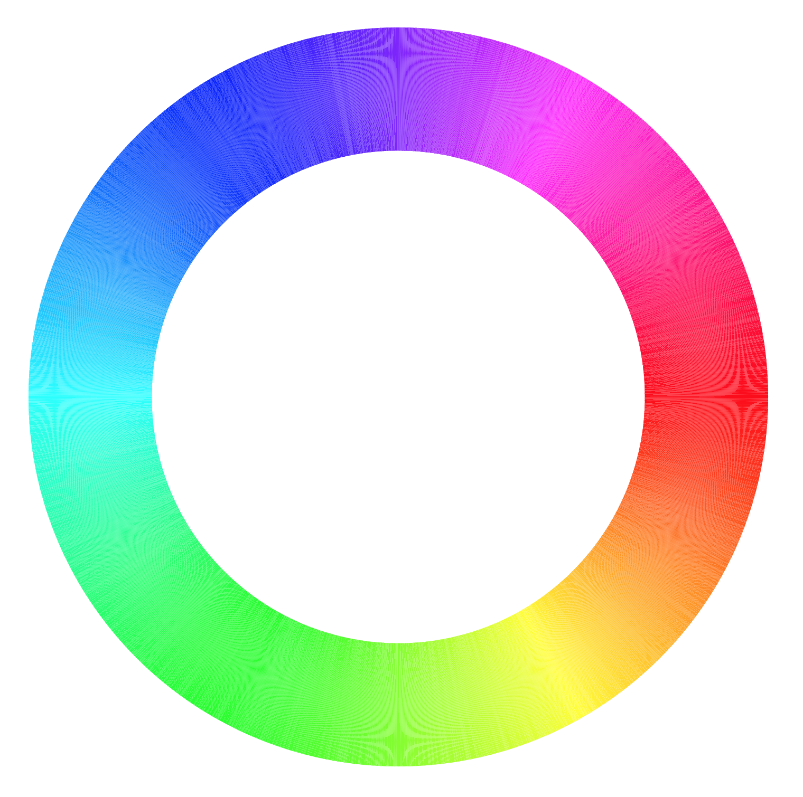
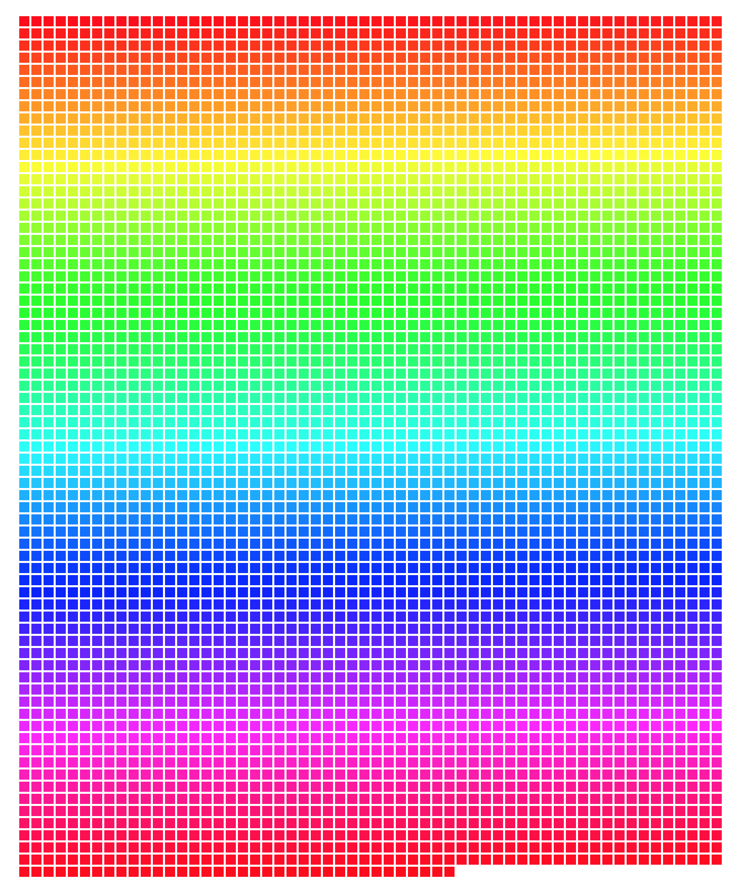

# 12-bit-color-chart

Yo, okay, disregard the old approach.  I realized sweeping through HSL
space in uniform 4096 increments and then transforming to RGB would get
a full chromatic representation in order.  So I did that.

Getting the wheel to render was a bit more work -- but you should be
able to see the whole spectrum as a result.  Go to
[this page](kamalasaurus.github.io/) to check it out.  Open the console
and run `getColorArrays()` in the window and you'll see the same list
represented by the json in this repository.

You can pull it down and adjust radii and stuff if you want to make it
bigger to analyze the swatches more closely.

Maybe I could have just made it a 64 x 64 grid of squares though 🤔

Actually, I'll do that real quick.  It should be easier to reason about.

...

Okay, that was quick.  Anyway, `processingArrays.txt` will have the
color codes in sequence order and processing syntax.

I've attached images of the charts below for convenience.

## Question

So the glasses work with prisms right?  Physically, there are only 3
color sub-pixels (R, G, B), that vary in brightness per pixel.  This
exploits the fact that humans have 3 cones in their eyes, so a
combination of red and blue light will excite our eyes with a similar
pattern as violet light (which is much higer in frequency than blue).
So, considering there's no light at the violet frequency (only red and
blue) how exactly is the prism accommodating for this physical reality?
Wouldn't it just generate 3 sub-spread images for each pixel?  One for
each color channel?

